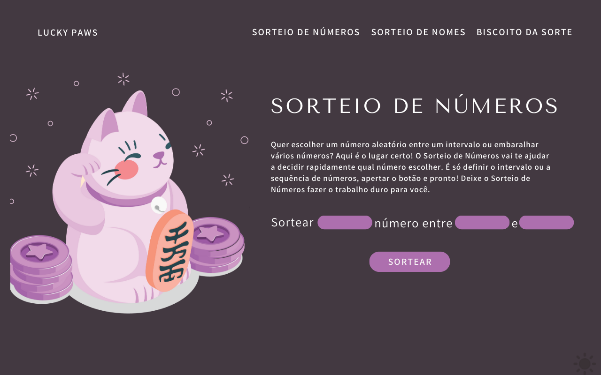
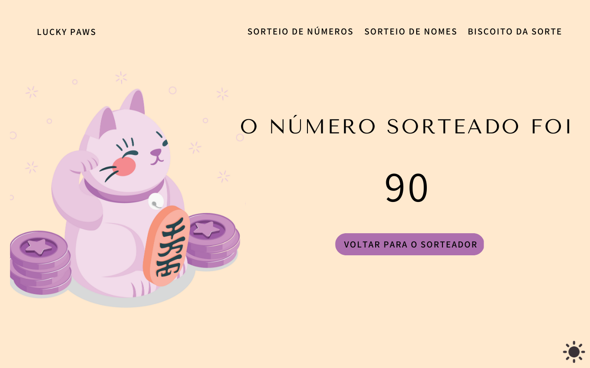
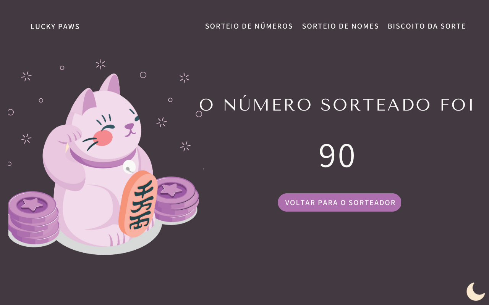

<h1 align="center"> ʕ •ᴥ• ʔ	Lucky Paws Page </h1>

I made this simple project for a page of drawing numbers, names and fortune cookies. I'm learning JavaScript and trying to apply it to my web projects to add functionality to the pages.

🌱 With this project I intend to improve my skills in JavaScript language.

<h2>(◡‿◡✿) Behind the project</h2>

Doing research on possible topics I found the figure of Maneki Neko. Maneki Neko is a traditional Japanese figure representing a cat with one paw raised, usually seen in shops, restaurants and other commercial establishments. It is believed that this figure brings luck and prosperity to the business.

The cat can have its left or right paw raised, and there are different meanings associated with each position. The raised right paw is considered an invitation to wealth and luck, while the raised left paw is seen as an invitation to attract customers and people to the establishment.

Because of that, I chose to use the Maneki Neko with the right paw raised on my website, to bring luck to the players.

<h2>(˵ •̀ ᴗ - ˵ ) ✧Project Concept on Canva</h2>

I created the entire website layout in Canva. I created all the screens for drawing numbers, although they are not yet implemented.

It is important to remember that the site was designed for use on computers. I don't have a mobile version yet, but I'll work on it soon!

<h2>ฅ՞•ﻌ•՞ฅ Features</h2>

I have created some features for the website. Using JavaScript, I have created the functionality of Light Mode and Dark Mode, as well as the functionality of drawing random numbers.

<h2>/ᐠ - ˕ -マ How to access the project</h2>
<a href="https://maridamaso.github.io/lucky_paws/">Click here to access</a>
<h2>(◍•ᴗ•◍)♡ ✧* Image Credits</h2>

Special thanks to Flaticon and Freepik who have excellent free images for use in study projects like this one.

<a href="https://br.freepik.com/vetores-gratis/ilustracao-do-conceito-de-gato-da-sorte_35874181.htm#query=lucky%20cat%20png&position=3&from_view=search&track=ais">Imagem de storyset</a> no Freepik  
<a href="https://www.flaticon.com/br/icones-gratis/meia-lua" title="meia-lua ícones">Meia-lua ícones criados por Bharat Icons - Flaticon</a>  
<a href="https://www.flaticon.com/br/icones-gratis/clima" title="clima ícones">Clima ícones criados por Freepik - Flaticon</a>  
<i class="fi fi-br-menu-burger"></i>
